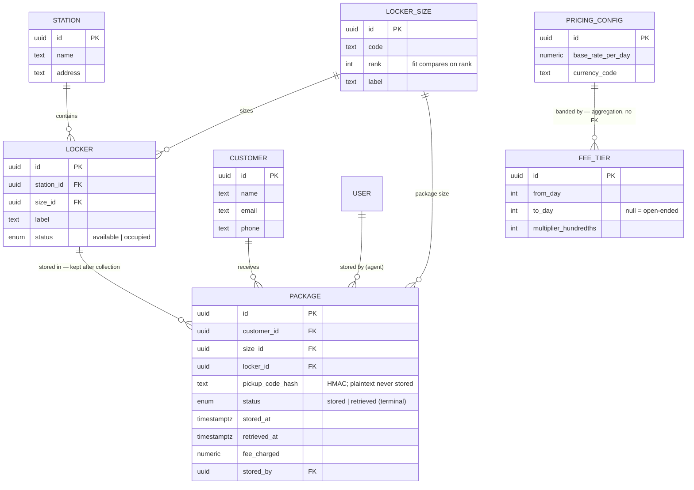
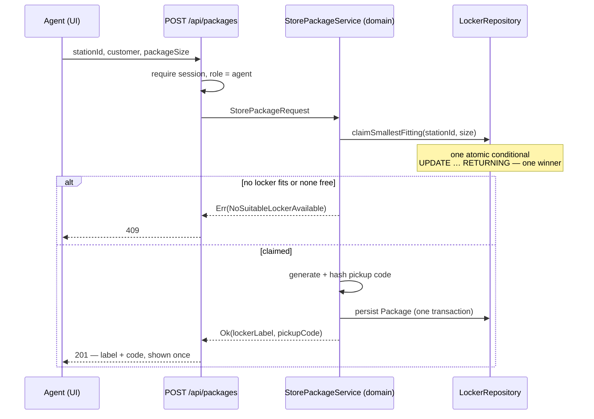
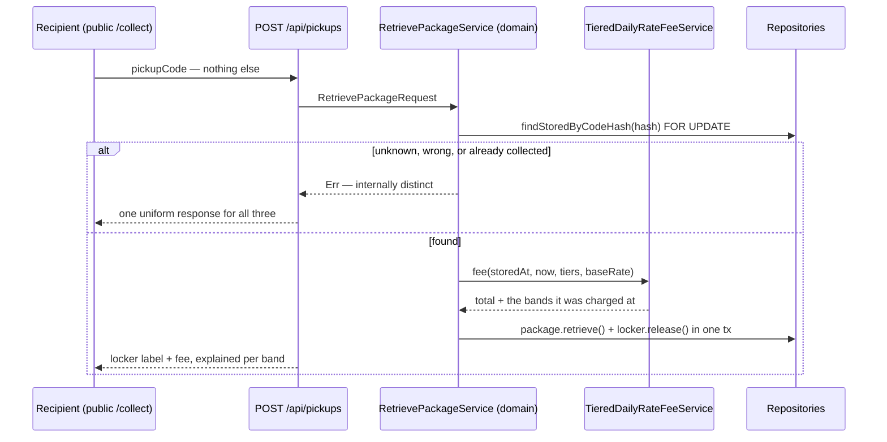

# Smart Package Locker

A locker network for parcel drop-off and collection. A delivery agent stores a package and gets back a locker label and a six-character pickup code; the recipient types that code — nothing else, no account — and is told which locker is open and what the storage fee came to.

> **Status: complete.** The scaffold, test harness, architectural enforcement, database, the whole domain core, authentication, the master-data admin surface, both package flows — store and collect, over HTTP and through the UI — and the concurrency contention proof are all in place. See [Progress](#progress).

**Reading order for a reviewer:** [Running it](#running-it) to see it work, [Architecture](#architecture) for the shape and the diagrams, [The invariant everything serves](#the-invariant-everything-serves) for the concurrency answer, [Testing](#testing) for how it is proven. The visual system lives in [DESIGN.md](./DESIGN.md); repo-specific pitfalls for tooling live in [AGENTS.md](./AGENTS.md).

## Running it

### The whole thing in Docker

Requires Docker only. No Node, no pnpm, no `.env` file.

```bash
docker compose --profile demo up --build   # http://localhost:3000
```

That builds the app, waits for Postgres, migrates, seeds, and starts the server. Both steps are re-runnable — migrations are tracked and the seed never overwrites a row — so a restart against an existing volume is a no-op, and `docker compose --profile demo down -v` gives a clean slate.

The image is a **demo image, not a production one**: it carries `drizzle-kit` and `tsx` on purpose so the container can bring an empty database up by itself, and `docker-compose.yml` holds a committed `BETTER_AUTH_SECRET` so the stack runs with no setup. Neither belongs on a real deployment.

`NEXT_PUBLIC_DEMO_MODE` is a **build** argument, not only a runtime variable. Next inlines `NEXT_PUBLIC_*` into the client bundle, and `NODE_ENV` is production in this image, so setting it at runtime alone would leave the affordances below compiled out.

### For development

Requires Node 20.9+, pnpm, and Docker.

```bash
pnpm install
cp .env.example .env.local          # then fill it in — see the comments in the file
docker compose up -d --wait         # Postgres 18 only; the app profile stays down
pnpm db:migrate
pnpm db:seed                        # two staff accounts, master data, lockers
pnpm dev                            # http://localhost:3000
```

### Signing in

`pnpm db:seed` creates the two staff accounts, both with the password **`smartpackage`**. Re-running it leaves existing accounts alone.

| Email                     | Role    | Lands on       |
| ------------------------- | ------- | -------------- |
| `admin@smartpackage.test` | `admin` | `/admin`       |
| `agent@smartpackage.test` | `agent` | `/agent/store` |

These are demo credentials on a local database, published so a reviewer never has to guess.

### Testing affordances

Two things exist only to make this quick to evaluate, and both are gated behind `DEMO_MODE` in `lib/demo-mode.ts` — on outside production, and opt-in on a hosted demo with `NEXT_PUBLIC_DEMO_MODE=true`. The API route behind them answers **404** when it is off, so it does not appear to exist.

- **Sign-in has a role picker.** One tap signs in as `admin` or `agent`, through the same code path as the form.
- **The collect page can mint test parcels.** "Create parcel" stores a real one via `StorePackageService` and shows its code; "Use" fills the six cells.
- **Stay length is selectable** — Today / 1d / 3d / 7d / 14d — so a collection can be charged across real fee tiers without waiting. It backdates through the service's own `Clock` rather than editing `stored_at` afterwards, so the fee comes from a genuine stay. A 7-day parcel collects at **$22.00** — `5d@$2.00 + 3d@$4.00` — which is the piecewise banding the collect screen explains.
- **"Reset" deletes every parcel and frees every locker**, returning the app to its seeded state.

**Pre-existing parcels cannot be listed, and that is the design working.** A pickup code is shown once and only its hash is kept — the partial unique index on that hash is what lets `/collect` ask for six characters and nothing else. Listing live codes would mean persisting plaintext, which would delete the property the whole flow rests on. So the panel mints parcels and holds their codes **in memory for the life of the process**, never in the database. Collected codes drop off the list automatically, because it is filtered against the real package status.

**Two accounts, and no way to make a third.** There is no sign-up: collecting a parcel needs no account — the code is the credential and `/collect` is public — so a self-service account would grant precisely the access an anonymous visitor already has. The endpoint is closed with `disableSignUp`, not merely unlinked, and a test asserts a sign-up request creates nothing.

Both accounts are provisioned by the seed through Better Auth's own context, which is also how the tests make an account. Roles are **granted, never chosen**: `role` carries `input: false`, so it cannot travel in any request payload and is settable only on that provisioning path.

Hooks are not cloned, so enable the commit guard once per clone:

```bash
git config core.hooksPath .githooks
```

### Commands

| Command                                                                 | Notes                                                                       |
| ----------------------------------------------------------------------- | --------------------------------------------------------------------------- |
| `pnpm dev` / `build` / `start`                                          | Turbopack is the default in Next 16 — there is no `--turbopack` flag        |
| `pnpm test`                                                             | whole suite                                                                 |
| `pnpm test:unit`                                                        | domain, dtos, components, hooks and utils — the sub-second development loop |
| `pnpm test:integration`                                                 | needs Postgres running                                                      |
| `pnpm test:watch`, `pnpm test:coverage`                                 |                                                                             |
| `pnpm lint`                                                             | Next core-web-vitals **plus** layer boundaries and domain purity            |
| `pnpm typecheck`, `pnpm format`                                         |                                                                             |
| `pnpm db:generate` / `db:migrate` / `db:push` / `db:seed` / `db:studio` |                                                                             |
| `DATABASE_URL=$TEST_DATABASE_URL pnpm db:migrate`                       | migrates `smartpackage_test` — `db:migrate` alone only touches the dev DB   |

A single file, and a single test by name:

```bash
pnpm test src/domain/utils/money.test.ts
pnpm test -t "charges a seven-day stay piecewise"   # no `--`; pnpm forwards it and jest reads it as a path
```

## Architecture

Clean architecture, dependencies pointing inward.

```mermaid
flowchart TB
    subgraph P["Presentation — app/ · components/ · hooks/"]
        RH["Route handlers<br/><i>guard · validate · delegate · map</i>"]
        UI["React screens + TanStack Query hooks"]
    end
    subgraph D2["src/dtos"]
        DTO["Wire shapes<br/><i>imports domain; domain never imports back</i>"]
    end
    subgraph DOM["src/domain — imports NOTHING"]
        SVC["Services<br/><i>store · collect · fit · selection · fee</i>"]
        ENT["Entities<br/><i>Locker · Package</i>"]
        VO["Value objects<br/><i>Money · PickupCode · StorageDuration</i>"]
        IFC["Interfaces<br/><i>Clock · IdGenerator · PickupCode* ·<br/>Repository&lt;T&gt; · UnitOfWork</i>"]
    end
    subgraph INF["src/infrastructure"]
        REPO["Drizzle repositories + UnitOfWork"]
        AUTH["Better Auth"]
        CONT["container.ts — composition root"]
    end
    UI --> RH
    RH --> DTO
    RH --> SVC
    SVC --> ENT & VO
    SVC -.->|"depends on"| IFC
    REPO -.->|"implements"| IFC
    CONT --> REPO & AUTH
    RH --> CONT
```



Infrastructure sits _below_ the domain and points **up**: the domain declares the interfaces it needs; infrastructure supplies the Postgres implementations. The arrows crossing into the domain all land on interfaces — the domain never learns Postgres exists.

### Code structure

```
src/
├── domain/            imports NOTHING
│   ├── entities/      business objects with lifecycles and invariants
│   ├── utils/         value objects — values that validate themselves at construction
│   ├── services/      the swappable rules — fit, selection, fee (Strategy) —
│   │                  and the flows that orchestrate them: store, collect,
│   │                  install a locker, register a station
│   ├── interfaces/    everything the domain needs but will not implement:
│   │                  Clock, IdGenerator, PickupCode*, Repository<T>, UnitOfWork
│   └── shared/        Result, error taxonomy
├── dtos/              wire shapes — imports domain; the domain never imports back
└── infrastructure/    imports domain + dtos
    ├── database/      drizzle client, schema, migrations, repositories
    ├── external/      better-auth
    └── container.ts   composition root — the only file that knows every concrete type

app/                   route handlers + pages — the controllers
components/            React components — the presentation layer
components/ui/  lib/   shadcn primitives. Leaves, not a layer.
hooks/                 every TanStack Query call, one hook per file;
                       hooks/api.ts is the axios client and the cache keys
utils/                 small adapters with no layer of their own — the system
                       clock, the uuid and pickup-code generators, the hasher —
                       and beside them the doubles that stand in for each.
                       Every double is named fake-*, stub-*, in-memory-*,
                       test-* or *-fixture, and lint bans those from production
```

There is no `src/presentation`: Next _is_ the frontend, so the presentation layer is Next's own folders rather than a parallel tree inside `src/`. The layer boundary is still enforced — `components/ui` is classified as the design system and `components/` as presentation, so a shadcn primitive cannot reach a repository or even a DTO, while a screen beside it can.

The direction is not conveyed by the folder names, so it is enforced instead: `pnpm lint` fails the build on a wrong-direction import, and each rule was verified by writing the violation and watching it be rejected.

`app/` is the controller layer and cannot move: Next's routing is file-system based, so a route handler only exists at `app/**/route.ts`. **There is no separate use-case layer.** A handler guards, validates, delegates and maps — nothing else. Every concrete implementation it delegates to is wired in `container.ts`.

**The behaviour lives in `src/domain/services/`**, and it can, because the `Repository<T>` and `UnitOfWork` contracts live in `src/domain/interfaces/`. A domain service orchestrating a whole flow still imports nothing outside the domain, so storing and retrieving a package are tested the same way a fee calculation is: no database, no HTTP, no framework, in milliseconds. The in-memory repositories in `utils/` are what make that possible.

That is the payoff from putting the contracts in the domain rather than a layer above it. A flow that needs a repository does not need to leave.

Aliases: `@domain/*`, `@dtos/*`, `@infrastructure/*`, and `@/*` for the repo root. Not `@types/*` — TypeScript reserves that prefix for DefinitelyTyped packages and rejects the import with `TS6137`.

This is not decoration. The load-bearing rules — locker allocation, fee tiering, size fit, code generation — are pure functions of their inputs. Behind a database, every test of them needs a container and the development loop crawls. Dependency-free, the whole domain suite runs in under a second, which is what makes test-first practical.

**The rule is enforced, not documented.** `pnpm lint` fails on a wrong-direction import, on a framework or driver import inside `src/domain`, and on `new Date(…)`, `Date.now()`, `Math.random()`, `crypto.*`, `node:*` or `process.env` anywhere inside `src/domain`. Each of those was verified by deliberately writing the violation and watching lint reject it. Time, ids and pickup codes reach the domain through the `Clock`, `IdGenerator` and `PickupCodeGenerator` interfaces — that is what makes the domain tests both instant and deterministic.

Domain **tests** carry one narrower exemption: they may write `new Date("2026-01-01T00:00:00.000Z")` to pin an instant, because a test that cannot name a moment cannot assert a fee boundary. The zero-argument `new Date()` stays rejected there too, along with every other ambient source. Both halves of that split are verified by probe rather than assumed — a guard that quietly stops firing is worse than no guard.

### Where a business rule goes

`entities/`, `utils/` and `services/` are one layer, not three. Clean architecture's inner circle is "enterprise business rules"; how that circle is subdivided is a cohesion question, and the answer here is a single rule with three outcomes:

| Ask                                                                             | Home             | Because                                                                                                                                                                                                           |
| ------------------------------------------------------------------------------- | ---------------- | ----------------------------------------------------------------------------------------------------------------------------------------------------------------------------------------------------------------- |
| Is this about one **value** being well-formed, or two of them combining?        | **value object** | It has no identity and no lifecycle. `Money` cannot be negative and never rounds twice; `PricingConfig` cannot have a gap in its bands. Enforced at construction, so nothing downstream can hold a malformed one. |
| Is this "may this **thing** move from state A to state B?"                      | **entity**       | It has identity and a lifecycle, and the rule is an invariant that must hold for its whole life. `Locker.occupy` refuses an occupied locker; `Package.retrieve` refuses a second collection.                      |
| Could the specification plausibly ask for a **different version** of this rule? | **service**      | Strategy. Swapping it must not require editing an entity.                                                                                                                                                         |

The third row is the one that looks like scattering and isn't. The brief's own stretch goals ask for alternative rules — fit by dimensions instead of by rank, a base rate that varies by size. With `fits()` written into `Locker`, each of those is surgery on the entity that holds the system's core invariant. As a service it is a new class and one line of wiring, and `Locker` is never reopened.

So `Locker` knows _whether it may be occupied_ (invariant, always true, never varies) while `OrdinalFitService` knows _whether a package fits it_ (a rule the brief offers alternatives to). Both are business logic; only one of them is allowed to change.

An entity holding no behaviour would be the actual architectural failure here — an anemic model, where `locker.status = 'occupied'` is assignable from anywhere and the invariant is enforced by whoever remembers to check.

### Interfaces

Every source of non-determinism is an interface, which is why the domain tests need no mocking framework:

| Interface                                                           | Declared in | Real                                            | Test double                               |
| ------------------------------------------------------------------- | ----------- | ----------------------------------------------- | ----------------------------------------- |
| `Clock`                                                             | domain      | `SystemClock`                                   | `FixedClock(instant)`, `AdvanceableClock` |
| `IdGenerator`                                                       | domain      | `UuidV7Generator`                               | `SequentialIdGenerator`                   |
| `PickupCodeGenerator`                                               | domain      | `RandomPickupCodeGenerator`                     | `StubPickupCodeGenerator([...])`          |
| `PickupCodeHasher`                                                  | domain      | `HmacPickupCodeHasher(pepper)`                  | `FakePickupCodeHasher`                    |
| `LockerFitService` / `LockerSelectionService` / `StorageFeeService` | domain      | ordinal fit / smallest-fit-first / tiered daily | pure — no double needed                   |
| `Repository<T>` and its aliases                                     | domain      | `EntityRepository` subclasses over Drizzle      | in-memory fakes                           |
| `UnitOfWork`                                                        | domain      | `UnitOfWork` over `db.transaction` — _T403_     | `InMemoryUnitOfWork`                      |

`Repository<T>` is the whole contract for storage: `findById` and `findAll`, generic in the entity, stated once. A collection that does something a generic one cannot — an indivisible locker claim, an address that resolves to a person, a fee table read as one validated object — adds just that method as an alias of the generic, in the same file. Six per-entity interface files collapsed into it.

No implementation declares `implements`. TypeScript checks a repository against the shape structurally where it is handed to a service, to the `UnitOfWork` or to the container, which is the only place a mismatch could do harm. On the implementation side the shared mechanics — the connection that may be a transaction, the `deleted_at IS NULL` filter, the actor stamp, the one way to fail when a row will not rebuild — live in `BaseRepository`, and `EntityRepository` adds the single-table `findById` and `findAll` that five repositories used to hold a copy of each.

There is no `Notifier`. Notification is out of scope, and an interface with a logging implementation and no caller would be an abstraction added for a need the spec does not have.

### Domain model



Every domain table also carries the five audit columns listed under [Data](#data). Two readings the diagram compresses: `package.locker_id` stays populated after collection — the row is the audit trail, and the locker is freed by its own `status`, not by unlinking — and `fee_tier` carries no foreign key because there is one pricing configuration; the tiers reach the domain only through `PricingConfig`, which validates the band set as a whole. A partial unique index on `pickup_code_hash` where `status = 'stored'` is what lets `/collect` ask for six characters and nothing else.

State machines are deliberately tiny, and illegal transitions return errors rather than throwing. `Locker` is `available ⇄ occupied`. `Package` is `stored → retrieved`, terminal — so retrieving twice fails, which is the code-replay edge case.

### The two flows





### The invariant everything serves

**`Locker` is the consistency boundary, and its invariant is: at most one package occupies a locker at any time.** It is the only thing concurrency can break.

That shapes the code. Allocation is **one atomic conditional `UPDATE … RETURNING`** inside the repository, not a read followed by a write in the calling service — which is why `claimSmallestFitting(stationId, size)` is a repository method with a business-sounding name rather than a `find` plus a `save`. The read-then-write version passes single-threaded tests and double-books under load. Measured here, on this schema, with twenty concurrent stores against a station holding three large lockers:

| Claim           | Succeeded    | Lockers used | Parcels behind an occupied door |
| --------------- | ------------ | ------------ | ------------------------------- |
| read-then-write | **20 of 20** | 3            | **17**                          |

Collection has the same shape of race from the other side — two requests holding one code — and the same class of fix: `findStoredByCodeHash` reads the parcel row `FOR UPDATE`, so the loser's re-read finds a parcel that is no longer `stored` and answers exactly as a replay does. The contention suite proves both directions: twenty concurrent stores win three lockers, and twenty concurrent collections of one code open one door and invoice one fee.

### Errors are results

The domain returns `Result<T, E>`. "No suitable locker" and "wrong pickup code" are expected _outcomes_, not exceptional ones — under contention a failed claim is normal. A thrown error means a bug or an infrastructure failure. One mapper turns the error taxonomy into status codes, so the domain knows nothing about HTTP even though the handler that calls it is an HTTP file.

**Retrieval failures are deliberately indistinguishable in the response.** An unknown code, a wrong code and a code whose parcel has already gone all return the same shape and status, because distinguishing them would tell an attacker which locker labels are real and which hold packages. The internal error types stay distinct for logging and tests; only the response is flattened.

### Data

- **Money never touches a float.** Integer minor units in the domain, `numeric(12,2)` in Postgres, never Drizzle's `mode: 'number'`. Rounded half-up once on the final total, never per tier.
- **A pickup code has no attempt cap.** Six characters over a 30-symbol alphabet is 729 million codes, so guessing one is uninteresting — but a code identifies a parcel on its own, so an attacker is trying for _any_ parcel in the network rather than one locker's, and nothing rate-limits the attempt. The mitigation is an attempt cap, specified and deliberately parked as stretch — and it cannot be keyed per locker the way it was originally written, because a collection request names no locker. Naming both here is the honest version; leaving them out would read as not having noticed.
- **The fit rule is written twice**: `OrdinalFitService` in the domain, and `s.rank >= $1` inside the atomic claim's SQL. Atomicity is why — a claim that consulted the domain would be a read and then a write, which is the race the claim exists to close. They are kept honest by the in-memory repository delegating to the real service, so a disagreement surfaces as a failing domain test; an integration test asserting the SQL order matches the policy is still owed.
- **Pickup codes are stored hashed** and compared by hash, in constant time. A code is a bearer credential for a physical object; plaintext at rest would make a database read a master key to every locker. The hash is HMAC-SHA256 under a server-side pepper rather than a bare digest: 729 million candidates is minutes of GPU time against a bare digest column, and the pepper is what puts the whole table out of reach of a database read alone. The pepper is a constant in `pickup-code-hasher.ts` rather than configuration — this is a demonstration system, and a variable a reviewer has to set is a clone that stores packages nobody can collect. A deployment would read it from a secret store, because a pepper in the repository is a pepper everyone with the repository has.
- **UUIDv7 primary keys**, generated through `IdGenerator` so entities are valid before they reach a repository, with `DEFAULT uuidv7()` as a safety net. Postgres 18 provides `uuidv7()` natively — no extension.
- **Five audit columns on every domain table**: `created_at`, `created_by`, `updated_at`, `updated_by`, `deleted_at`. Deliberately no `deleted_by` — a soft delete is a write, so `updated_by` already records the actor. Reads filter `deleted_at IS NULL` in the shared `notDeleted` helper, so no caller ever writes that filter.
- Better Auth owns `user`, `session`, `account`, `verification`. Its schema is CLI-generated, and the two edits it carries are recorded in a header comment on the file so a regeneration re-applies them: `uuid` id columns with a `uuidv7()` default, so `created_by` can be a foreign key to `user.id` and so a seed insert gets the same kind of key as everything else. No audit columns and no soft delete — an account is not a domain table.
- `snake_case` columns, **singular** table names (`locker`, not `lockers`), `timestamptz` never bare `timestamp`.

### Patterns used, and refused

**Strategy** for the three swappable rules — fit, selection and fee — so ordinal fit can become dimensional fit without reopening an entity. (The other domain services, which orchestrate the flows, are not strategies; nothing about them is meant to be swapped.) **Repository + Unit of Work**, for testability and to give the transaction boundary an explicit owner. **Value Object**, so validity is enforced at construction and nothing downstream ever sees a malformed code or a negative amount.

Deliberately absent: builder hierarchies for two entities, an event bus for one out-of-scope notification, CQRS at this scale, repository decorators with nothing to cross-cut. The absence is the point — each of those would be ceremony here.

## Testing

Deliberately bottom-heavy. Fast tests get run constantly; slow ones get skipped and rot.

```
src/domain/**/*.test.ts          no deps, fake Clock/Id/Code — including the store
                                 and retrieve flows, against in-memory repositories
src/dtos/**/*.test.ts            wire-shape mapping
src/infrastructure/**/*.test.ts  real Postgres, cleaned between
  …/concurrency.test.ts          real pool, parallel claims — the contention
                                 proof. Arrives with T502.
app/api/**/*.test.ts             status codes, validation, wire shape, guard wiring.
                                 Never business behaviour — the domain owns that.
components/**/*.test.tsx         jsdom
```

`pnpm test:unit` covers `src/domain`, `src/dtos`, `components` and `hooks`; `pnpm test:integration` covers `src/infrastructure` and `app/api`. The two partition the suite exactly — a file matching neither would still run under `pnpm test` while both named scripts skipped it silently, which has happened here twice and is checked for after any move.

Tests are co-located (`foo.ts` → `foo.test.ts`) and named as behaviour, not method — `charges a seven-day stay piecewise, at 9x base and not 14x`, not `calculateFee works`. A few files cover a pair that only makes sense together: the two locker services share `locker-services.test.ts`, and `FeeTier` is tested through `pricing-config.test.ts`, because a tier is only meaningful inside a validated tier set.

Flow tests attach to the **repository interface** with in-memory fakes rather than to a database. Because those interfaces are declared in the domain, storing and retrieving a package are domain services and are tested exactly like a fee calculation — no database, no HTTP. That is what keeps `test:unit` sub-second.

The concurrency test was **watched failing against a naive implementation before it was trusted** — a contention test that passes against broken code is worse than no test. Restoring read-then-write turns 8 of its 10 cases red, and the numbers in the table above are that run. `contention.test.ts` also keeps the comparison permanently: one case drives the read-then-write pattern directly and asserts it hands one locker to several agents, so the atomic claim is measured against the thing it replaced rather than only against itself. That case uses a barrier — every caller finishes reading before any caller writes — because hoping for the interleaving gives a test that passes on a fast machine and fails in CI, and a flaky concurrency test teaches you to ignore a red suite.

It has to run on real Postgres, and through a pool wide enough to matter: twenty requests through the default pool of four is a test of four-way contention and a queue. PGlite is worse than a narrow pool — it serialises every transaction through a single WASM backend, so `SKIP LOCKED` never skips and the suite goes green against a genuinely broken claim.

## Interface

A role-aware nav sits in the header on every page, so what each role can reach is visible rather than something a reviewer has to guess at from URLs. It decides only what is _offered_ — every destination is still guarded server-side, and an agent typing `/admin` is bounced.

**Collection asks for the code and nothing else.** No station, no locker number, no sign-in: the recipient has six characters from a message and is standing in front of the doors. That is only safe because no two parcels awaiting collection can share a code — a partial unique index on the hash of a stored parcel's code, and a store that retries with a new code when it loses that race. Collecting is recorded on submit — parcel collected, locker released, in one transaction — and the screen names the locker that opened. Physically opening a door is out of scope, and naming the locker is where this system's responsibility ends.

**The fee is explained in the bands it was charged at**, which is the only form of it that reconciles. A seven-day stay under the seeded table costs 18.00 — five days at 2.00 and two at 4.00 — and a single stated rate would put 14.00 on the screen beside a charge of 18.00. So the collect screen lists each band the stay reached, and the bands come back from the same pass that computed the total rather than from a second calculation that could disagree with it. Rates, never per-band subtotals: the total rounds once, across every band.

The code being the only credential is a real trade, and the screen says so rather than leaving it implied: a production build would confirm a collection against the recipient's email, and the notification channel that would carry that is out of scope across the whole spec. There is also no attempt cap, named under [Data](#data).

Three surfaces, and not the same shape, because their users are not in the same place. `/agent/store` and `/collect` are 375px-first — single column, large controls, one bottom-anchored action — because an agent is standing at a wall of lockers holding a package, and a recipient is holding a phone and a message. `/admin` is 1280px-first with dense tables, because an admin is at a desk — it registers a station, installs lockers into it, and shows free-against-total per station and size, which is the shape of the question "where am I short of large lockers". Visual system in [DESIGN.md](./DESIGN.md).

Route handlers are the HTTP adapter only: guard, validate, delegate to a domain service, map errors to status codes. No SQL and no business rules in `route.ts`. Reads go through route handlers rather than Server Actions, which are queued and would serialise a parallel fan-out.

On the client side, every query and mutation is a hook in `hooks/`, one per file, and they all talk through the axios instance in `hooks/api.ts`. Its response interceptor is where `{ error: { code, message } }` becomes a plain `Error`, so a form renders the sentence the error taxonomy already chose instead of inventing one from a status code — and a component never sees an HTTP client at all.

## Commits

Commits follow Conventional Commits with the scopes `domain`, `dtos`, `infrastructure`, `api`, `admin`, `db`, `auth`.

The work was built test-first `TDD`, one commit per red→green→refactor cycle — a `test(…)` commit stating the behaviour, then the `feat(…)` that satisfies it. That history is **squashed into one commit per phase** here, so `git log` reads as the shape of the build rather than as sixty steps through it. The unsquashed sequence is preserved on the `pre-squash-full-history` tag for anyone who wants to see the cycles:

```bash
git log --oneline pre-squash-full-history
```

## Progress

|                                                                         |      |
| ----------------------------------------------------------------------- | ---- |
| Scaffold, test harness, boundary lint, Postgres, debug configs          | done |
| Domain core — value objects, entities, services                         | done |
| Authentication, roles, guards, login UI                                 | done |
| Master data — schema, migrations, seed, repositories, admin API and UI  | done |
| Store and collect — flows, persistence, transaction, API, both screens  | done |
| Atomic locker claim and pickup-code uniqueness                          | done |
| Concurrency contention proof — 20 parallel claims against real Postgres | done |
| Review pass — spec fidelity, standards, dead code                       | done |
| Demo affordances and one-command Docker stack                           | done |
| Submission docs — this README, architecture diagrams, design system     | done |
